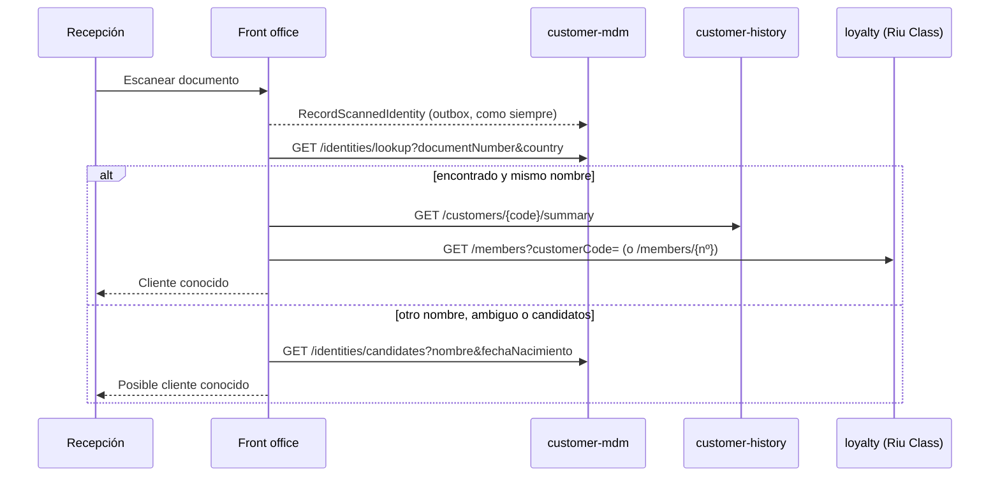

**El 70 % de los clientes llega sin identificar**: la reserva, sobre todo de touroperador u OTA, no trae
email ni documento, y el MDM los crea como provisionales. Por eso reconocerlos en el check-in es el
camino normal, no la excepción. Y un mismo cliente enseña documentos distintos según el viaje: unas veces
el DNI, otras el pasaporte, otras ninguno.

## Qué ve recepción

En el paso **Identidad** del check-in y en la ficha de la reserva (bloque **Cliente**, y una línea en
cada huésped de la lista), por huésped:

| | Cuándo | Qué se enseña |
| :-- | :-- | :-- |
| **Cliente conocido** | Con certeza: el documento escaneado es de un cliente con el mismo nombre; recepción lo confirmó con su número Riu Class o su email; o el huésped ya llega con código de la cadena (`C-…`) | Nombre, **«N estancias · M noches»**, las últimas estancias, los hoteles, **nivel y puntos Riu Class**, y cómo se le reconoció |
| **Posible cliente conocido: ¿es usted…?** | El documento es de un cliente con otro nombre, o de varios (ambiguo); o no se conoce y hay **candidatos** con el mismo nombre y fecha de nacimiento | Solo nombre y fecha de nacimiento de los candidatos. **Nunca el historial** |
| Nada | No se le encuentra, o el MDM no contesta | El check-in sigue igual |

Debajo del panel, dos búsquedas para preguntar al cliente:

- **Nº Riu Class o email** → *Confirmar cliente*: da certeza. Un número de 8 cifras se completa con `RC`
  delante.
- **Nombre, apellidos y fecha de nacimiento** → *Buscar por nombre*: solo da «posible».

**Al confirmar**, si el documento escaneado era nuevo, el front office se lo dice al MDM
(`RecordScannedIdentity` con `confirmedCustomerId`): el MDM une el código provisional del huésped en el
cliente confirmado y le añade el documento. La próxima vez, ese pasaporte ya da certeza.

:::note[Reglas]
- **El check-in nunca se bloquea por esto.** El MDM, el historial y Riu Class se consultan con un
  timeout corto (1 s de conexión, 2 s de lectura); sin respuesta, no se enseña nada.
- **El MDM no entra en el camino del guardado.** El escaneo se guarda y sale al MDM
  (`RecordScannedIdentity`) como siempre; la consulta (`/identities/lookup`) es una lectura aparte.
- **Minimización (RGPD).** Recepción ve un resumen: estancias, noches, últimas estancias, hoteles, nivel y
  puntos. Los consumos al detalle solo están en *Historial de clientes*, la pantalla de la central. Un
  documento ambiguo no enseña los datos de nadie.
- **A quien ya llega con código `C-…`** no se le rebaja nunca a «posible» por escanear: un documento que no
  coincide no le quita la certeza que da su código.
:::

## Antes de que lleguen: el resumen de las llegadas

El front office prepara por adelantado a **los clientes que repiten** entre las llegadas de hoy y mañana
(y las atrasadas): cada huésped que la reserva nombra con código de la cadena (`C-…`) **y tiene estancias**
se guarda con el resumen de su historial y su nivel Riu Class (`arrival_briefing`).

- **En *Reservas***: columna **Cliente** con «Repite · 5 estancias · GOLD» y la vista **Clientes que
  repiten**. El botón **Preparar llegadas** lo hace al momento; si no, se prepara solo cada 10 minutos
  (`frontoffice.arrivals-briefing.interval`).
- **En el check-in**, un huésped ya preparado sale como «Cliente conocido» sin preguntar entonces a
  `customer-history` ni a `loyalty`: si esos servicios no contestan en el mostrador, recepción lo ve igual.
- Un código provisional sin estancias **no** se prepara: es alguien a quien aún no conocemos. Si un
  servicio no contesta al preparar, se queda lo de la vuelta anterior; una reserva que deja de llegar
  (check-in, cancelación, no show) pierde el suyo.
- `seed known-customers` prepara las llegadas al acabar, para que la demo los enseñe sin esperar.

## Cómo funciona



- **El resultado se guarda** (`pax_recognition`, y el último escaneo en `pax_scan`): Mateu reconstruye el
  paso en cada clic, y el reconocimiento tiene que seguir ahí.
- **Las respuestas se cachean** unos segundos (30 s si hay dato, 10 s si no): la cabecera, el panel y la
  lista de huéspedes preguntan por el mismo cliente en cada clic.
- **Puertos con doble en memoria**: `CustomerDirectory` (MDM), `StayHistory` (historial) y `LoyaltyStatus`
  (Riu Class), con su implementación HTTP. Cuando exista el servicio real de Riu Class, solo cambia la
  implementación de `LoyaltyStatus` (hoy llama al servicio de demo `loyalty`).
- Las cabeceras y el perfil del titular usan el historial y Riu Class cuando el cliente es conocido; si no,
  lo que había (los valores fijos de los datos de demo).

## En la demo

```sh
deploy/demo/demo-prep.sh seed known-customers [--count 3]
```

Después del onboarding: elige titulares con código de la cadena entre las llegadas (y los que están en casa)
y, para cada uno, deja en el MDM **su documento** (el mismo que leerá el escáner) y un **número Riu Class**,
lo da de alta como socio en `loyalty`, siembra **estancias pasadas** en el historial y pone su nivel. Se puede
repetir: lo hace igual con los mismos.

Los tres casos:

1. **El documento que ya conocemos**: *Escanear documento* → «Cliente conocido».
2. **Un pasaporte nuevo del mismo cliente**: *Simular pasaporte nuevo* (mismo nombre y fecha de nacimiento,
   otro número) → «Posible cliente conocido» → confirmar con su número Riu Class → «Cliente conocido», y el
   pasaporte queda en el MDM como otro documento suyo.
3. **Sin documento**: la búsqueda por número Riu Class o email.

Al hacer el **check-out**, la estancia llega al historial (`StayClosed`) y suma puntos Riu Class.

## Fuera de alcance

- El servicio real de Riu Class: `loyalty` es una demo, y el front office solo depende del puerto
  `LoyaltyStatus`.
- El historial anterior a la PoC (Rumbo).
