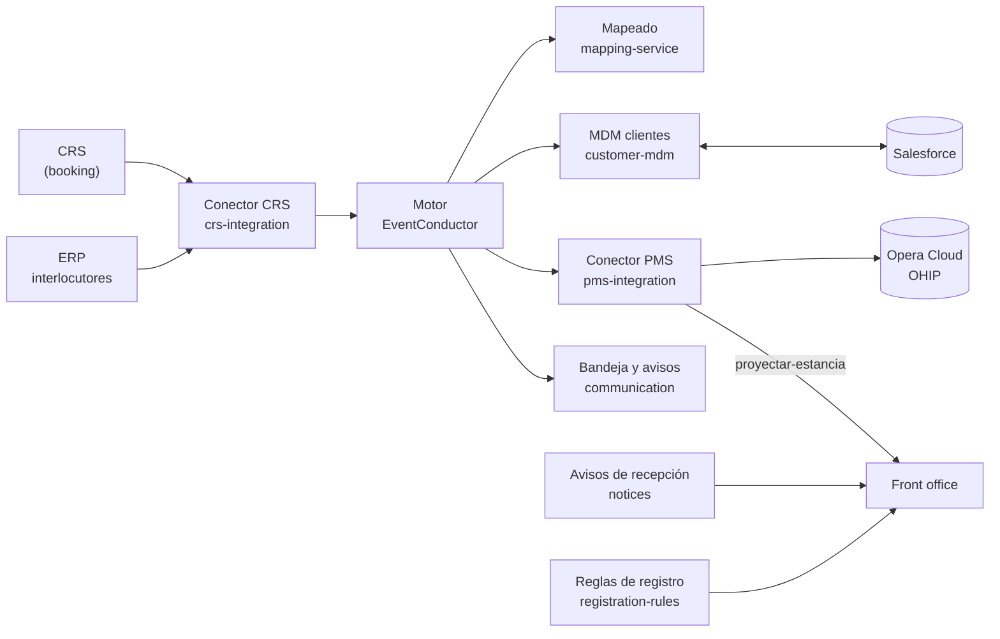

**ec-demo1** es la prueba de concepto de la **capa anticorrupción (ACL)** de Riu entre su CRS y
Opera Cloud, construida sobre dos piezas propias: **EventConductor**, el motor de procesos, y
**Mateu**, el framework de interfaces. Empezó como un despliegue de EventConductor en Kubernetes y
hoy es la PoC completa:

- una **reserva** creada, modificada o cancelada en el CRS llega a **Opera Cloud** (OHIP, tenant UAT,
  propiedad XMAR) con sus códigos traducidos, y de Opera al **front office** del hotel;
- lo que no se puede resolver solo —un código sin equivalencia, un interlocutor que no está en Opera,
  un rechazo de Opera— se convierte en una **causa** con nombre y el proceso **espera, no falla**;
- los **clientes** se resuelven en un MDM propio y se limpian y deciden en **Salesforce**;
- un **plano de control** gobierna las integraciones, el mapeado, las **reglas de registro** del
  kárdex, los avisos, la auditoría y los **agentes de IA**;
- todo se despliega en el clúster **ec1** con un script, y se observa en Grafana.

## Los sistemas

| Sistema | Papel en la PoC |
| :------ | :-------------- |
| **CRS** (`systems/crs/booking`) | Hace de Rumbo: reservas con habitaciones, huéspedes, precio por noche y cobros. Dueño de la reserva |
| **ERP** (`systems/erp`) | El maestro de interlocutores: turoperadores, agencias, empresas |
| **Opera Cloud** | El PMS real, por OHIP (tenant UAT). No se despliega: se usa |
| **Front office** (`systems/front-office`) | La recepción del hotel: reservas, check-in, check-out, walk-in, kárdex |
| **Avisos de recepción** (`systems/notices`) | Los avisos de un cliente, una reserva o una agencia; el front office guarda una copia |
| **Reglas de registro** (`control-plane/registration-rules`) | Qué datos del huésped exige la ley de cada destino; las define el plano de control y las aplica el front office |
| **Salesforce** | El maestro del cliente: limpia, deduplica y decide los cambios |
| **Motor** (EventConductor) | Lleva cada reserva por sus pasos; imágenes publicadas, no se compila aquí |

Y entre ellos, la integración (plano de datos) y quien la gobierna (plano de control):
[Arquitectura](/guias/arquitectura/) lo explica pieza a pieza.

## Dónde verlo

| Qué | URL |
| :-- | :-- |
| Plano de datos (Vaadin) | https://ec1.mateu.io |
| Plano de datos (Redwood) | https://rw.ec1.mateu.io |
| Plano de control (Vaadin) | https://console.ec1.mateu.io |
| Plano de control (Redwood) | https://rw-console.ec1.mateu.io |
| Front office del hotel | https://front.ec1.mateu.io |
| Keycloak | https://auth.ec1.mateu.io |
| Grafana | https://grafana.ec1.mateu.io |
| Consola de Kafka (Redpanda) | https://kafka.ec1.mateu.io |
| Esta documentación | https://doc.ec1.mateu.io (usuario `riu`; la contraseña es `DOCS_PASSWORD` de `deploy/.secrets/credentials.env`) |

El usuario de la demo es `demo` / `demo` (está en el fichero del realm y es público a propósito);
llega a las dos consolas porque tiene los roles `user`, `admin` y `ai-admin`. El resto de
contraseñas se generan en cada despliegue y no están en el repositorio: ver
[Despliegue](/operacion/despliegue/).

## Tres repositorios

| Repositorio | Qué tiene |
| :---------- | :-------- |
| **ec-demo1** (este) | El despliegue y todas las aplicaciones que se compilan: consolas, gateway, sistemas, integración, plano de control, IA y contratos |
| [**ec-definitions**](https://github.com/miguelperezcolom/ec-definitions) | Las definiciones que importa el motor al arrancar: procesos (`definitions/workflows/*.ec`), contratos de tarea (`definitions/tasks/*.ectask`) y formularios. `master` está protegida: se cambia por PR |
| [**eventconductor**](https://github.com/miguelperezcolom/eventconductor) | El motor. Aquí corre desde imágenes publicadas |

Un proceso se cambia con un PR a ec-definitions, no con una llamada a una API: el motor lo reimporta.

## Documentos de la PoC

Los documentos de trabajo de la PoC están en
[`docs/poc-acl/`](https://github.com/miguelperezcolom/ec-demo1/tree/master/docs/poc-acl) y esta web
los resume y enlaza:

- [`plan.md`](https://github.com/miguelperezcolom/ec-demo1/blob/master/docs/poc-acl/plan.md) — objetivo, alcance, decisiones e hitos (H1–H14).
- [`demo.md`](https://github.com/miguelperezcolom/ec-demo1/blob/master/docs/poc-acl/demo.md) — el guion de la demo, flujo a flujo, con lo probado en ec1.
- [`llamadas-sincronas.md`](https://github.com/miguelperezcolom/ec-demo1/blob/master/docs/poc-acl/llamadas-sincronas.md) — qué va por Kafka y qué por HTTP, y por qué.
- [`conclusions.md`](https://github.com/miguelperezcolom/ec-demo1/blob/master/docs/poc-acl/conclusions.md) y [`cost-log.md`](https://github.com/miguelperezcolom/ec-demo1/blob/master/docs/poc-acl/cost-log.md) — las conclusiones y el coste a fecha de cierre de H9 (22-09-2026), antes de escribir en el tenant real.
- [`grabacion-demo.md`](https://github.com/miguelperezcolom/ec-demo1/blob/master/docs/poc-acl/grabacion-demo.md) — cómo se graba el vídeo de la demo.

Para quien llega nuevo, [`ONBOARDING.md`](https://github.com/miguelperezcolom/ec-demo1/blob/master/ONBOARDING.md)
dice qué pedir (acceso al clúster, contraseñas) y cuatro cosas del clúster que, sin saberlas, cuestan
una tarde.
