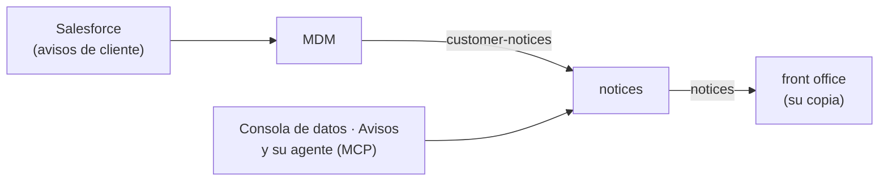

Un **aviso de recepción** es lo que el mostrador tiene que saber antes de dejar entrar o salir a los
huéspedes: «pedir el pasaporte original», «cuna en la habitación», «bono obligatorio: sin bono no hay
check-in». Es cosa del negocio, así que vive en el **plano de datos**: el servicio `notices`
(`systems/notices`), con su pantalla **Avisos** en la consola de datos (`ec1.mateu.io`, `rw.ec1.mateu.io`).

## De qué y cuándo

| | |
| :-- | :-- |
| **Sobre qué** | Un **cliente** (su código del MDM, `C-…`), una **reserva** (su localizador del CRS) o una **agencia** (su código en el ERP: agencia, turoperador o empresa) |
| **Cuándo lo ve recepción** | Uno o varios momentos: **antes de la llegada** (`PRE_ARRIVAL`, al preparar la llegada), **check-in**, **durante la estancia** (`IN_HOUSE`) y **check-out** |
| **Tipo** | *Informativo*, *Importante* o *Bloqueante*. Uno bloqueante obliga a marcarlo como leído antes del check-in (o del check-out) |
| **Dónde** | Un hotel (código del CRS, p. ej. `MRU01`) o, vacío, toda la cadena |
| **Vigencia** | Desde y hasta, opcionales: se ve si está en vigor algún día de la estancia |

## Quién es el maestro de cada uno

- **Los de cliente son de Salesforce**, como hasta ahora (ver [Clientes](/integracion/clientes/#avisos-de-recepción)):
  se crean allí o desde la ficha del cliente en *Clientes*, y el MDM los publica en `customer-notices`.
  El servicio de avisos **los toma de ese topic y los vuelve a publicar**, con el mismo id y la misma
  versión; en su pantalla se ven, pero **no se editan**: guardar uno se rechaza y la ficha dice dónde se
  gestiona. `STAY`, el nombre que les da Salesforce a la estancia, se lee como `IN_HOUSE`.
- **Los de reserva y agencia son del servicio de avisos**: se crean, cambian, activan y desactivan en
  **Avisos → Avisos de recepción**, o los pide el agente de la consola de datos con sus herramientas MCP
  (`listNotices`, `createReservationNotice`, `createPartnerNotice`, `deactivateNotice`). Un aviso **no se
  borra**: se desactiva, y recepción deja de verlo.
- Un aviso de agencia lleva el **nombre** de la agencia tal como lo tiene el ERP (se consulta al crearlo;
  un código que el ERP no tiene se rechaza): es el nombre con el que se escribió su perfil en Opera, y con
  el que Opera dice qué agencia vendió cada reserva.

## Cómo llegan al front office

- Cada cambio de cualquier aviso sale **entero** en el topic **`notices`** (`NoticeChanged`, clave
  `tipo:id` del asunto, con versión), por el outbox del servicio.
- El front office lo consume con su inbox y guarda **su copia** en la tabla que ya tenía para los
  avisos de cliente; gana la versión mayor. No pregunta al servicio en cada pantalla: si el servicio o
  la red no responden, el mostrador sigue teniendo los avisos (continuidad del frontal, F017).
- El front office **ya no escucha `customer-notices`**: los avisos de cliente le llegan por `notices`,
  con los mismos ids y versiones, así que los que ya tenía se quedan como estaban.
- `POST /notices/republish` (dentro del clúster) vuelve a publicar todos los avisos tal como están: para
  un lector que perdió su copia.

## Qué hace el mostrador con ellos

Para una estancia se juntan los del **titular y los acompañantes** que son clientes de la cadena, los de
la **reserva** (su localizador; en un walk-in, también el que le dio el CRS) y los de **la agencia** que
la vendió; del hotel o de la cadena; vigentes algún día de la estancia.

- **Preparando la llegada**: la reserva enseña arriba los avisos de la reserva y de su agencia para antes
  de la llegada y para el check-in; los de cada huésped, bajo su fila en la sección de huéspedes.
- **Check-in**: el asistente empieza por el paso *Avisos* si hay alguno; con uno **bloqueante**, hay que
  marcar **«He leído el aviso»** o `CheckInService` rechaza el check-in (del mostrador o del agente) y lo
  audita.
- **Durante la estancia**: el panel de la estancia los enseña arriba.
- **Check-out**: los de check-out, con los avisos del kárdex, piden **«Entendido»** antes de cobrar y
  cerrar.

Cada fila dice de qué es el aviso: *Cliente · Ana García (titular)*, *Reserva 12E45*, *Agencia Nordic
Travel Group AB*.

## Lo que queda abierto

- El front office sabe la agencia de una estancia **por su nombre**, que es lo que le da Opera: un aviso de
  agencia se empareja por el nombre que tiene el ERP (o por el código, si la estancia lo trae). Si el nombre
  de la agencia cambia en el ERP y no en Opera, el aviso deja de encontrarla hasta que se vuelva a
  proyectar el perfil. Llevar el código del interlocutor hasta la estancia lo resolvería.
- Hoy los avisos de reserva y de agencia los crea una persona (o el agente) en la consola de datos. El CRS
  (observaciones de la reserva) o el ERP (condiciones de una agencia) podrían crearlos por integración más
  adelante.
