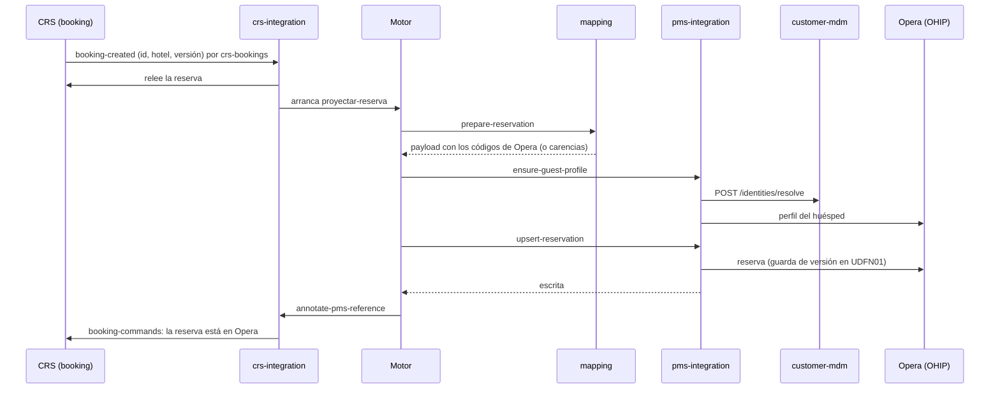

## 1. El CRS avisa, no manda el dato

`booking` hace de Rumbo: reservas con cabecera (hotel, canal, interlocutor, bono externo, fechas,
moneda, estado y **versión** monótona), habitaciones con su tipo, tarifa y régimen propios del CRS,
huéspedes por habitación con el titular marcado, y cobros con un id estable. Los códigos son de estilo
CRS, distintos de los de Opera a propósito, para que la ACL tenga trabajo de verdad.

No hay CDC. Cada cambio publica un **evento de dominio** por **outbox** en la misma transacción, en el
topic `crs-bookings`: `booking-created`, `booking-modified` y `booking-cancelled`, con la clave de la
reserva y su versión, **no su contenido**. Una reserva nueva nace confirmada y con sus cobros en un solo
cambio: un evento y un `proyectar-reserva`.

## 2. La ACL del CRS relee y arranca el proceso

`crs-integration-service`:

- **Inbox**: deduplica por `eventId`.
- **Relectura**: pide la reserva al CRS (`GET /bookings/{id}`) y el interlocutor al ERP: el aviso solo
  avisa, el dato se relee tal como está ahora.
- **Modelo canónico**: la traduce a `Reservation` (`contracts-reservation`); nadie más allá de este
  servicio conoce `booking`.
- **Router**: una tabla evento → proceso, en configuración (`application.yaml`):

  ```yaml
  routes:
    reservation-created: proyectar-reserva
    reservation-modified: proyectar-reserva
    reservation-cancelled: proyectar-cancelacion
    partner-changed: proyectar-interlocutor
  ```

  Un proceso por evento, con la clave `hotel + localizador`. Antes de arrancarlo mira qué hoteles
  tienen integración (`GET /integrations/views`, en caché 30 s): un hotel sin integración activa no
  arranca procesos que no van a ninguna parte.

## 3. Preparar: el mapeado

`mapping-service` atiende `prepare-reservation`: resuelve **todas** las traducciones de una vez y
devuelve el payload listo o la **lista completa de carencias**. El diccionario es de cadena, con
excepciones por propiedad, y cubre los tipos de `CodeType`:

`HOTEL`, `ROOM_TYPE`, `RATE_PLAN`, `BOARD`, `CHANNEL`, `PAYMENT_METHOD`, `CANCELLATION_REASON`,
`PARTNER_TYPE` y `MARKET`.

Un canal del CRS es, en Opera, un *source code* y un *market code*: `CHANNEL` se traduce a un source
code con el market code como atributo. Cada equivalencia se **versiona** y entra en vigor solo cuando
**una persona la aprueba**; el agente de mapeado puede proponerlas (ver
[Causas, avisos y bandeja](/integracion/causas-y-avisos/)).

## 4. El huésped: identidad y perfil

`ensure-guest-profile` pregunta al MDM quiénes son los pasajeros (`POST /identities/resolve`, con el
titular y los huéspedes de cada habitación). El MDM los reconoce **solo con certeza** —documento, o
email con el mismo nombre— o crea un cliente provisional. Después el conector asegura en Opera el
perfil del huésped. Si el MDM no responde, el perfil se escribe sin código y la venta sigue: el MDM no
es una puerta. Ver [Clientes: MDM y Salesforce](/integracion/clientes/).

## 5. El conector escribe en Opera

`pms-integration-service` es la única pieza que conoce OHIP. No tiene base de datos.

- **Autenticación**: token OAuth (`client_credentials`) con caché y renovación, y en cada llamada
  `x-app-key` y `x-hotelid`. Cómo llegar a cada propiedad no está en su configuración: es de la
  integración de cada hotel, registrada en la consola y leída de `integrations-service`, con el secreto
  cifrado en reposo.
- **Reserva** (`rsv`): la busca por el **localizador del CRS** como referencia externa; lee el UDF de
  versión (`UDFN01`) y lo compara con la versión que llega; crea o actualiza con el desglose diario,
  tarifa fija, los perfiles enlazados y el enrutamiento de la ventana de folio. **Una versión rezagada
  no se graba** (termina como `STALE`).
- **Cancelación**: con el motivo mapeado, idempotente (si ya estaba cancelada, no es error).
- **Tras escribir o cancelar** publica `pms-reservations`, que es lo que arranca la proyección al
  front office.

La clasificación de lo que responde OHIP decide qué hace el proceso:

| Respuesta de OHIP | Qué hace el proceso |
| :---------------- | :------------------ |
| Timeout, 5xx, límite de caudal | Transitorio: el motor reintenta el paso |
| 4xx determinista | Causa `PMS_REJECTED` y el proceso espera |
| Conflicto (la reserva ya existe) | Se lee y se actualiza |

Pasado `RETRY_ALERT_AFTER` (10 min en el manifiesto) fallando, el conector deja un aviso
`RETRYING_TOO_LONG` en la bandeja, que se cierra solo cuando el paso pasa.

## 6. El CRS se entera

`annotate-pms-reference` deja la orden en el outbox de `crs-integration-service` (topic
`booking-commands`) y el CRS anota el `reservationId` de Opera. `resolve-projection` libera lo que
esperaba a que la reserva llegase al PMS, como una cancelación que llegó antes.

## El tenant real

Desde el hito H12 el conector escribe en el **tenant UAT de OHIP**, propiedad **XMAR** (MRU01 en el
CRS). Solo se escriben **reservas y perfiles de huésped** (con sus cancelaciones). Lo que ese tenant
hace distinto de las especificaciones públicas, o aún no tiene configurado:

- **Listar las propiedades de la cadena** da 403 a este cliente: el conector ofrece las de
  `OPERA_PROPERTIES` (`XMAR,XMU` en ec1) y lee cada una por su código.
- **UDF**: solo se guardan los que se llaman `UDFN01`…; con otro nombre, Opera los ignora sin decir nada.
- **Pago en hotel**: la forma de pago es `CASH` (`OPERA_PAY_AT_HOTEL_METHOD`).
- **Referencias externas en perfiles** y **depósitos al folio** necesitan configuración de un
  administrador de OPERA (una interfaz para las referencias de perfil y un cajero para el usuario de
  integración). Hasta entonces quedan apagados: `OPERA_PROFILE_REFERENCES=false`,
  `OPERA_POST_DEPOSITS=false`.
- **Un contexto por ejecución de la demo.** El localizador del CRS va en Opera como referencia externa
  bajo un contexto propio (`OPERA_EXTERNAL_SYSTEM`, `ECDEMO1` o `ECDEMO1-<MMddHHmm>` desde el ConfigMap
  `ec-demo-run`), y todas las reservas llevan la *Custom Reference* `EC-DEMO1`. Opera no se limpia
  nunca, así que cada puesta a cero estrena contexto para que un localizador nuevo no encuentre una
  reserva vieja. Ver [La demo](/operacion/demo/).
- **Disponibilidad**: Opera revalida y puede rechazar por falta de habitaciones (`RSV00138`). No falla:
  es una causa `PMS_REJECTED` y la reserva espera. Si después el CRS la cambia a algo que Opera acepta,
  esa versión entra y resuelve sola la causa de la anterior.

Los interlocutores **no se crean en Opera por la integración de la reserva**: se exportan del ERP con
su propio proceso (`proyectar-interlocutor`) y el ERP guarda qué perfil de Opera es cada uno, buscado
por su `CorporateId`. Una reserva que referencia un interlocutor que aún no está espera con la causa
`MISSING_PARTNER`.
