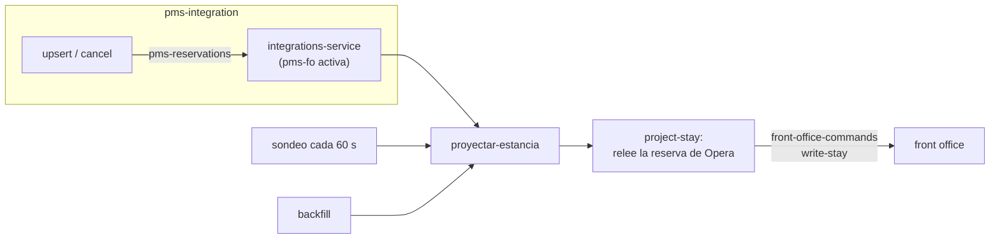

Las reservas van en cadena **CRS → PMS → front office**. El front office no recibe lo que se mandó a
Opera: recibe **lo que Opera tiene**, con los códigos y los nombres de Opera. Es otra integración, con
su propio ciclo de vida (hito H14).

## La integración

`FrontOfficeIntegration` en `integrations-service`, una por propiedad de Opera y su front office, con
su máquina de estados y su proceso de alta, `alta-integracion-fo`
(*Integrations → PMS → Front office → New*):

1. **Conexión**: Opera legible (token y la propiedad) y el front office responde.
2. **Catálogo**: el catálogo de la propiedad tal como lo lee un front office —tipos de habitación,
   tarifas con su nombre, todos los paquetes (también los que no se venden sueltos, como el desayuno que
   llega dentro de una tarifa) y las habitaciones con su tipo— va al front office
   (`replace-catalogue`). La puerta se abre cuando el front office dice que tiene ese mismo.
3. **Backfill**: las reservas de la ventana —en casa o con llegada dentro del horizonte
   (`horizonDays`, 60 por defecto)—, un `proyectar-estancia` por reserva.
4. **Activación** por una persona: desde ahí fluyen los cambios.

**Ámbito** (`scope`): `CHAIN`, el que se usa por defecto, trae solo las reservas que escribió la
integración de la cadena (las que llevan la *Custom Reference* de la ejecución); `ALL` trae todas las de
la propiedad, también las nacidas en Opera.

:::caution[No `ALL` en ec1]
El UAT de Opera es compartido. Con `ALL`, el front office de MRU01 pasó a tener todas las reservas de
XMAR de la ventana —814 estancias con huéspedes reales de otros, a la vista con el usuario `demo`—. El ámbito
no se cambia después del alta: otro ámbito es otra integración.
:::

## Cómo llega una reserva

- **Por evento**: lo que la integración crs-pms escribe en Opera lo avisa el conector
  (`pms-reservations`) y la integración pms-fo, si está activa, arranca `proyectar-estancia`.
- **Por sondeo**: OHIP no tiene en la búsqueda de reservas un filtro «modificadas desde» (los
  parámetros de ese tipo se ignoran), y los *business events* exigen suscribir un sistema externo en la
  configuración de Opera, algo que esta integración no toca. Lo que sí da la búsqueda es el
  `lastModifyDateTime` de cada reserva. Así que la integración **sondea** (`FO_POLL`, 60 s): recorre las
  reservas de la ventana, 200 por página, y proyecta las modificadas desde su **cursor** (la última
  modificación ya proyectada), que avanza en la misma transacción que arranca los procesos.
- **Por backfill**: al dar de alta la integración.

El paso `project-stay` **relee la reserva de Opera** y la manda al front office por
`front-office-commands` (`write-stay`) con los códigos de Opera; el front office la lee con el catálogo
que tiene («Pensión Desayuno Adulto», no `BKF`). El cliente viene del MDM: qué cliente es el perfil de
Opera (su xref) y su golden record.

## Idempotencia y orden

- Cada proceso lleva como clave la reserva de Opera y su `lastModifyDateTime` (o el id del evento):
  `proyectar-estancia:XMAR:39484606:2026-09-28T00:44:46`. El motor no arranca dos veces la misma.
- El front office deduplica por `commandId` y **ordena por la versión de Opera**: una más antigua que
  la que tiene no se aplica; la misma se reaplica (así llega un cambio del cliente que no tocó la
  reserva, como una fusión en el MDM).
- `project-stay` publica sin outbox (el conector no tiene base de datos): si Kafka no lo toma, el paso
  falla y el motor lo reintenta; repetirlo no hace nada.

## Lo que hace recepción sube al PMS

El PMS es el maestro de la estancia. El check-in, el check-out y el no show de recepción salen del
front office por `front-office-events` y la integración pms-fo los registra en Opera con
`registrar-checkin`, `registrar-checkout` y `registrar-no-show-pms` (ver
[Los procesos del motor](/guias/procesos/)). Lo que queda en Opera vuelve por el camino de siempre:
el conector publica `pms-reservations` y `proyectar-estancia` manda la estancia con su estado de Opera
(`IN_HOUSE`, `CHECKED_OUT`). Lo que `write-stay` no dice llega como `record-reception`: que Opera lo
rechazó y por qué, la habitación en la que Opera tiene a los huéspedes, la factura del check-out. Los
**cargos** que recepción pone en el folio (y sus anulaciones) suben igual, con `registrar-cargo` y
`anular-cargo`, y su posteo en Opera vuelve como `record-charge`.

:::note[El no show, solo en la PoC]
En producción el no-show lo marca el **Night Audit de Opera** (OHIP no tiene una llamada que lo ponga)
y el front office solo lo refleja. El flujo «recepción marca no show → Opera lo anota → el CRS cobra»
existe para enseñarlo en la demo.
:::

Las llamadas a OHIP (`OperaFrontDesk`):

| Qué | OHIP |
| :-- | :--- |
| Asignar habitación | `POST /fof/v1/hotels/{h}/reservations/{id}/roomAssignments` (`criteria.roomId`) |
| Habitaciones que sugiere Opera (solo lectura) | `GET /fof/v1/hotels/{h}/reservations/{id}/verifyCheckIns` |
| Check-in | `POST /fof/v1/hotels/{h}/reservations/{id}/checkIns` |
| Fecha de negocio de la propiedad (solo lectura) | `GET /ent/config/v1/hotels/{h}/operaContext` (`hotelContext.businessDate`) |
| Salida anticipada, si la salida aún no es hoy para Opera (sin ella, FOF00107) | `PUT /csh/v1/hotels/{h}/reservations/{id}/earlyDeparture` (con el cajero) |
| Saldo del folio, por ventana (solo lectura) | `GET /csh/v1/hotels/{h}/reservations/{id}/folios?fetchInstructions=Windowbalances` |
| Saldar el folio con lo cobrado en el mostrador (sin saldar, FOF00108) | `POST /csh/v1/hotels/{h}/reservations/{id}/payments` (`action: Settlefolio`, con el cajero) |
| Check-out | `POST /csh/v1/hotels/{h}/reservations/{id}/checkOuts`, con `cashierId` (`OPERA_CASHIER_ID`; sin él, FOF00094) |
| Folios del check-out (solo lectura) | `GET /csh/v1/hotels/{h}/folioHistory?reservationIdId={id}&reservationIdType=Reservation&checkOut=true` |
| Documento de la factura | `POST /csh/v1/hotels/{h}/reservations/{id}/folios` (con el cajero) → `storedFolioId` → `GET /csh/v1/hotels/{h}/storedFolios/{id}` → `folioReportURL`. Solo funciona con el control `PERMANENT_FOLIO_STORAGE` activado, y en XMAR no lo está: el generate no devuelve `storedFolioId` y el front office sirve su proforma. Ver [Front office · Por qué se abre la proforma](/front-office/sistema-propio/) |
| No show | Un comentario en la reserva (`PUT /rsv/v1/hotels/{h}/reservations/{id}`, solo `comments`); el estado «No Show» lo pone el Night Audit |
| Estado de las habitaciones de un tipo, o de una (solo lectura) | `GET /fof/v1/hotels/{h}/rooms?roomType=` · `?fromRoomNumber=&toRoomNumber=` |
| Cargo de recepción en el folio (y su anulación, en negativo) | `POST /csh/v1/hotels/{h}/reservations/{id}/charges` (`transactionCode`, `price`, `postingReference` `FO:<línea>`, con el cajero) |
| Posteos del folio (solo lectura) | `GET /csh/v1/hotels/{h}/reservations/{id}/folios?fetchInstructions=Postings&summaryOnly=false` (sin `summaryOnly=false`, XMAR no da los posteos; la referencia vuelve con un blanco al final) |

Los **códigos de transacción** de los cargos de recepción (`ohip.charges` en pms-integration), de los
que XMAR deja postear a mano (`GET /csh/v1/hotels/XMAR/transactionCodes?manualPostAllowed=true`):

| Cargo del front office | Código de Opera |
| :-- | :-- |
| Late check-out (el del mostrador y el extra `late`) | 1200 «P200.-Supl Alojamiento» |
| Minibar (`MB-02`) | 1402 «P402.-Bebida Comedor» |
| Room service (`RS-01`), cena romántica (`cena`) | 1403 «P403.-Comida» |
| Lavandería (`LAU-04`) | 1516 «P516.-Lavandería Externa» |
| Cualquier otro (masaje, transfer, babysitting…) | 1851 «P851.-Ingr.Serv.Diversos» (el genérico) |

## Qué casa con lo que ya había

Una estancia se reconoce por la reserva de Opera; si no, por el localizador del CRS (su referencia
externa en el contexto de la ejecución); si no, por el walk-in que abrió recepción. Una reserva nacida
en Opera abre la estancia `OP-<confirmación>`.

Lo que no llega de Opera son los **acompañantes**: Opera solo tiene al titular (el conector no escribe
acompañantes). Si Opera no manda ninguno, la estancia conserva los que tenía.
