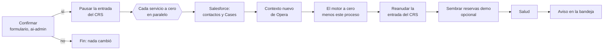

En la consola de control (`console.ec1.mateu.io`), **Demo** reúne las dos cosas que se le hacen a la
demo misma. Solo para administradores (`ai-admin`: el gateway no deja pasar `/_demo` a nadie más) y
**todo auditado**, con quién: lo ve **Audit** como «Demo: …».

Los scripts de [`deploy/demo/`](/operacion/demo/) siguen ahí y hacen lo mismo desde fuera
(`zero.sh`, `opera-outage.sh`); la página lo hace desde dentro, sin `kubectl` ni SQL.

## Resetear la demo

«Resetear la demo…» lanza el proceso **`reset-demo`** del motor (en
[ec-definitions](https://github.com/miguelperezcolom/ec-definitions/blob/master/definitions/workflows/reset-demo.ec)).
Lleva la demo al mismo cero que `zero.sh`, pero **sin parar ningún servicio y sin SQL desde fuera**:
cada servicio se vacía a sí mismo.

| Paso | Quién | Qué hace |
| :--- | :---- | :------- |
| Confirmar | formulario `confirmar-reset-demo` (motor de formularios) | Llega a la **bandeja** de los administradores (se reclama y se completa en *Tareas*); dice que también borra los contactos y Cases de **Salesforce**. Sin marcar «Sí», el proceso termina sin tocar nada. La otra casilla siembra al final las 10 reservas demo de MRU01 |
| Pausar la entrada | booking (`pause-intake`) | El CRS rechaza reservas nuevas, cambios y cancelaciones —asistente, API, MCP, «+ 10 reservas demo»— hasta que se reanude; como mucho 30 min |
| Cada servicio a cero | cada uno, tarea `reset` en su topic | Vacía **sus propias** tablas en una transacción, con sus consumidores de Kafka en pausa mientras tanto (la librería `supporting/demo-reset`): booking, ERP (su outbox), front office (y las habitaciones quedan libres), avisos, crs-integration, mapping, MDM, integraciones, comunicación, auditoría (menos las acciones «Demo: …») |
| Salesforce | customer-mdm (`clean-salesforce`) | Borra los Cases de petición de cambio y todos los contactos, de 200 en 200, y retoma los eventos de Salesforce desde ahora |
| Contexto de Opera | pms-integration (`new-opera-context`) | `ECDEMO1-<MMddHHmm>` (UTC): el conector lo usa **al momento, sin reiniciar**, y lo guarda en el ConfigMap `ec-demo-run` (para su próximo arranque y para los scripts). **Opera no se limpia nunca** |
| El motor a cero | integrations-service (`purge-engine`) | Borra procesos, pasos, formularios, candados, recursos, logs e índices **menos los del propio reset**. Es el último paso de datos |
| Reanudar la entrada | booking (`resume-intake`) | El CRS vuelve a admitir reservas |
| Sembrar | booking (`seed-demo-bookings`) | Solo si se marcó: las 10 reservas demo de MRU01 (sin integración se quedan en el CRS: el punto de partida del flujo 1) |
| Salud | integrations-service (`check-demo-health`) | La readiness de cada servicio y del motor, que no quede una caída de Opera simulada, y que el conector escriba bajo el contexto nuevo. No falla: lo cuenta |
| Aviso | integrations-service (`notify-reset-result`) | Un aviso en la bandeja con el resultado —quién lo lanzó, quién lo confirmó, el contexto nuevo, lo borrado— y su registro de auditoría «Demo: reset completado» |

Lo que se queda es lo configurado: interlocutores del ERP, habitaciones y catálogos del front office,
reglas de registro, definiciones de procesos, contenido, usuarios y Keycloak.

### Seguridad

- **Cada paso es idempotente**: vaciar lo vacío no hace nada; el contexto de Opera de un reset es
  siempre el mismo; el aviso y su auditoría son uno por reset. Repetir un paso nunca hace daño.
- **Un paso que falla se ve y se reintenta.** Cada paso se reintenta solo 3 veces; luego el proceso
  queda en **error** en la página (qué paso, cuántos intentos) y en el motor. «Reintentar el reset»
  repite lo que falló (el «Reintentar desde el fallo» del motor). «Cancelar el reset» lo para donde
  esté: lo ya vaciado, vaciado se queda.
- **Uno a la vez**: la página no lanza otro mientras haya uno en curso, esperando o en error.
- **La entrada del CRS** se reanuda en el paso «Reanudar»; si el reset se cancela o se queda en error
  antes, la pausa se levanta sola a los 30 min (`booking.intake.max-pause`). La página la enseña
  mientras dura.
- **Sólo un administrador confirma.** El formulario declara `requiredRoles: [ai-admin]`; la bandeja
  sólo se lo enseña a `ai-admin` (`communication.inbox.task-roles`, porque el motor de formularios con
  persistencia JPA aún no guarda los `requiredRoles`: arreglado en EventConductor, pendiente de
  release; cuando llegue, y con `WORKFLOW_SECURITY_FLOWAUTHORIZATION_ENABLED` en el motor de
  formularios, también reclamarlo y completarlo quedarán restringidos). Quién lo confirmó queda en el
  aviso final y en la página.
- **Nada fuera del namespace** `ec-demo1`: el único permiso de Kubernetes que se añadió es el del
  conector sobre el ConfigMap `ec-demo-run`.
- Lo que se quede en marcha entre que un servicio se vacía y el motor se vacía (un proceso que
  reintentaba, por ejemplo) puede volver a escribir algo en ese rato; el motor lo borra después, pero
  lo escrito en un servicio se queda. Por eso la entrada del CRS se pausa primero.

### Progreso

La página enseña el último reset: su estado, quién lo lanzó y quién lo confirmó, cada paso con su
estado e intentos, y el enlace al proceso en la consola del motor (`ec1.mateu.io/workflow/processes/…`).
«Actualizar» lo refresca.

### Desde la línea de comandos

`zero.sh` sigue haciendo lo mismo parando los servicios; `snapshot.sh`/`reset.sh` (la línea base) no
cambian.

## Simular que Opera no responde

Un **interruptor dentro del conector** (`pms-integration-service`): mientras está encendido, **toda
llamada a OHIP falla como un timeout** —escrituras, lecturas, el token—, tras una breve espera
(`OPERA_OUTAGE_DELAY`, 5 s). El proceso **espera, no falla**: el paso que escribe en Opera se reintenta
y, pasado el umbral, llega `RETRYING_TOO_LONG` a la bandeja.

- **Encender**, con su **apagado automático** (15 min por defecto, de 1 a 120): se apaga solo, aunque
  nadie lo apague; y un reinicio del conector también lo apaga.
- **Apagar**: Opera vuelve a responder y el umbral de aviso vuelve al del despliegue.
- **Umbral de aviso** (`RETRY_ALERT_AFTER`): se cambia **en caliente**, sin reiniciar el conector —2 min
  para enseñarlo en directo, 10 min el del despliegue.
- Mientras dura, **todas las consolas** (las dos de datos, la de control y el front office) muestran
  en la cabecera **«Simulación: Opera no responde»**.

`deploy/demo/opera-outage.sh` —el corte **de red** de verdad, con una NetworkPolicy— sigue igual.

### El flujo 6, con la página

1. Demo → aviso tras **2** min → **Encender la caída de Opera**.
2. Una reserva nueva de MRU01: `proyectar-reserva` reintenta `ensure-guest-profile`; el banner está en
   las consolas.
3. ~2 min después, el aviso `RETRYING_TOO_LONG` en la bandeja.
4. **Apagar la caída de Opera**: la reserva llega a Opera sola, una vez, y el aviso se resuelve.
